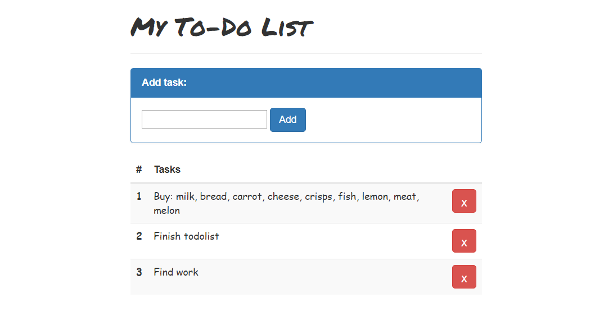

# Description:
To-Do List is a simple task list based on JavaScript. Write in it all your important affairs, so as not to forget. To-Do List will allow you to efficiently organize your working time. Everything can be written into it: from the shopping list to important business meetings. [Demo](https://maksymchak.github.io/todolist)

# How It Works:
The input exists for the user to type a task to be added to the list. When the user clicks the add button, a new task is created and added to the list. When the delete button is clicked the associated task is removed from the list.

# Built on:

* HTML
* CSS
* JavaScript (JQuery)
* BootstrapCDN
* Google Fonts

## Misc
Follow Me: [LinkedIn](https://www.linkedin.com/in/anton-maksymchak/), [Facebook](https://www.facebook.com/Anton.Maksymchak), [GitHub](https://github.com/maksymchak)

©[Anton Maksymchak](https://github.com/maksymchak) 2018
